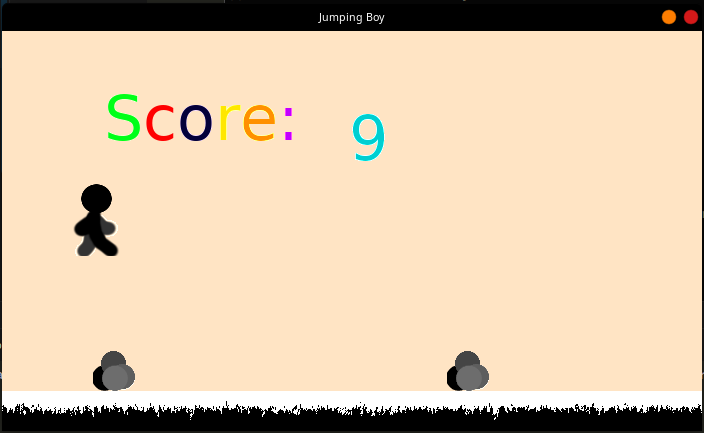
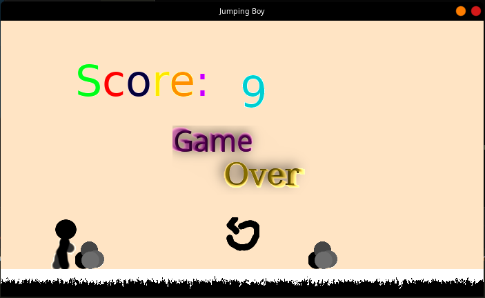

# Jumping Boy

Game made aiming a [Weekly Game Jam](https://weeklygamejam.itch.io/), but I couldn't get it finished in time.

Anyway, I used this simple game to create a simple helper library, [LittleCoins](github.com/gariel/LittleCoins)

90% of game logic is in `Game.cs` file and it's not a good code but it works.

- Game Play  

- Game Over  

